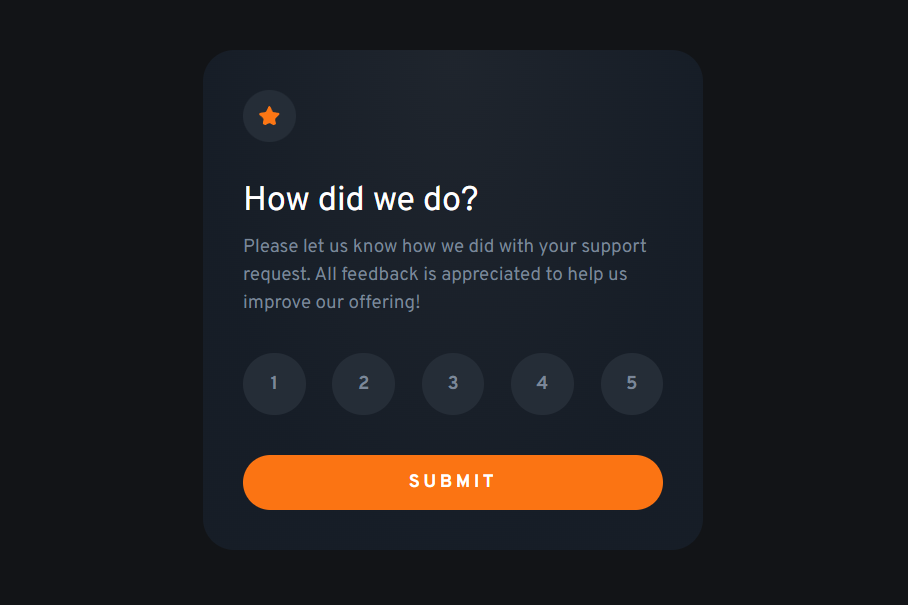
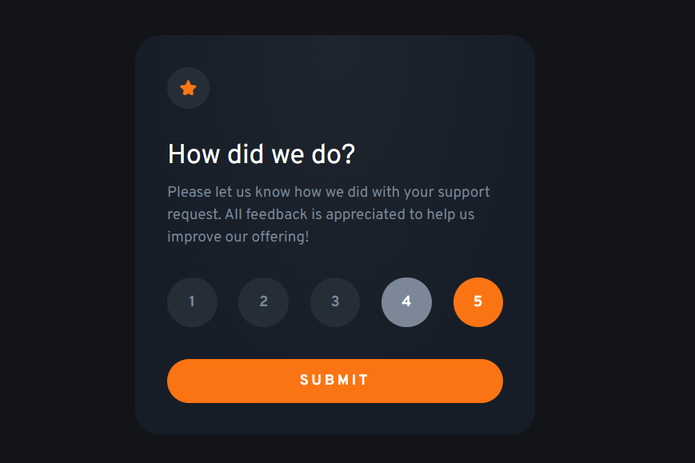
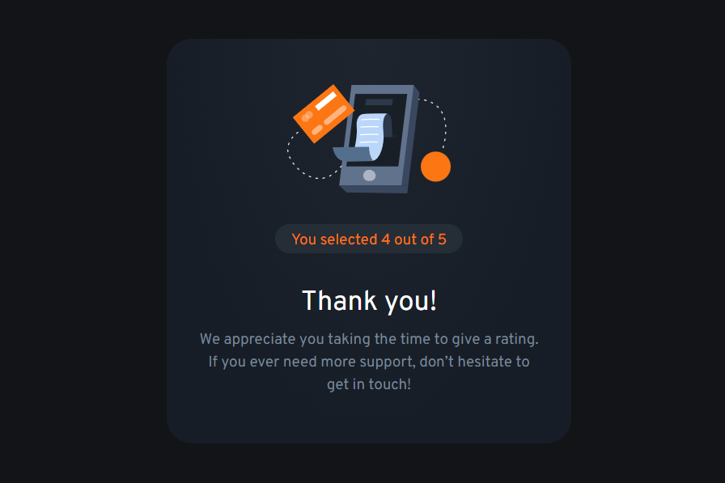

# Frontend Mentor - Interactive rating component solution

This is a solution to the [Interactive rating component challenge on Frontend Mentor](https://www.frontendmentor.io/challenges/interactive-rating-component-koxpeBUmI). Frontend Mentor challenges help you improve your coding skills by building realistic projects. 

## Table of contents

- [Frontend Mentor - Interactive rating component solution](#frontend-mentor---interactive-rating-component-solution)
  - [Table of contents](#table-of-contents)
  - [Overview](#overview)
    - [The challenge](#the-challenge)
    - [Screenshot](#screenshot)
    - [Links](#links)
  - [My process](#my-process)
    - [Built with](#built-with)
    - [What I learned](#what-i-learned)
    - [Continued development](#continued-development)
  - [Author](#author)

**Note: Delete this note and update the table of contents based on what sections you keep.**

## Overview

### The challenge

Users should be able to:

- View the optimal layout for the app depending on their device's screen size
- See hover states for all interactive elements on the page
- Select and submit a number rating
- See the "Thank you" card state after submitting a rating

### Screenshot






### Links

- Solution URL: [Frontend Mentor](https://www.frontendmentor.io/solutions/interactive-rating-component-solution-with-scss-and-flexbox-31vR2JaIQb)
- Live Site URL: [Github Pages](https://sophie-mc-dev.github.io/interactive-rating-component/)

## My process

### Built with

- Semantic HTML5 markup
- CSS custom properties
- Flexbox
- JavaScript

### What I learned

```css
background: radial-gradient(
  farthest-side at top center,
  hsl(215deg, 19%, 15%),
  hsl(215deg, 27%, 12%)
);
```

### Continued development

In the future I want to keep focusing on Flexbox and CSS layout styles since I had to change my approach quite a few times with this project as I wasn't getting the results I wanted in terms of spacing between elements. 

## Author

- LinkedIn - [Sofia Merino Costa](https://www.linkedin.com/in/sofia-m-costa/)
- Frontend Mentor - [@sophie-mc-dev](https://www.frontendmentor.io/profile/sophie-mc-dev)